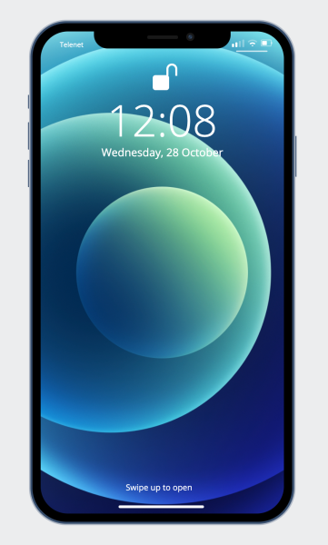

# CSS Workshop
Becode workshop for CSS

---

## Back to basics

Before you can start to get all creative with shapes in CSS, one of the most important things you have to know beforehand is the difference between and the use of `position: absolute` and `position: relative`.

### Short answer:
position: relative places an element relative to its current position without changing the layout around it, whereas `position: absolute` places an element relative to its parent’s position and changing the layout around it.

Without any custom styling, the standard position of elements will be static. Below you can see an example:
 

 

 

You can read [this](https://css-tricks.com/absolute-relative-fixed-positioining-how-do-they-differ/) article if you want more information about the position property.

If you're more of a visual/video type of person, you can look at [this](https://www.youtube.com/watch?v=3PDQDRJq5Ls) short explanation video about absolute vs relative positioning in CSS.
CSS-Tricks
Chris Coyier
Absolute, Relative, Fixed Positioning: How Do They Differ? | CSS-Tr...
Let's talk about the position property. I know beginners are curious about this. Here's a question I got recently: I am fairly new to web design, and

YouTube
Red Stapler
CSS Absolute vs Relative Position EXPLAINED!

## CSS Shapes

You might have come across illustrations built entirely with CSS or visited websites that use all kinds of shapes. If they aren't images, they probably are built with CSS. Basic shapes like squares, rectangles, triangles, etc. are easy to code but if you want a reference guide for all kinds of basic shapes, you can see them here: [Shapes of CSS](https://css-tricks.com/the-shapes-of-css/)

## Example of an iPhone built with CSS shapes/animations:
[link to the repo](https://github.com/jeremiaverhulst/css-illustrations)
 
[link to the live example](https://jeremiaverhulst.github.io/css-illustrations/)
 

### Tutorials for inspiration

Below you can find some nice and short tutorials that show you some illustrations you can make with CSS. You can try to make one of those, our you could come up with something yourself. Maybe your desk at home? A sofa? A plant? A house? Some famous landmark? The possibilities are endless. Just start doing. Start with something small and simple and let your creativity loose!

[Lamp](https://www.youtube.com/watch?v=69Lb9vIuJoY)
 
[Toaster](https://www.youtube.com/watch?v=G0HtHr46Awg&t=9s)
 
[Interactive TV](https://www.youtube.com/watch?v=rdjub7lr4C8)
CSS-Tricks
Chris Coyier
The Shapes of CSS | CSS-Tricks
CSS is capable of making all sorts of shapes. Squares and rectangles are easy, as they are the natural shapes of the web. Add a width and height and you

YouTube
Lenora Porter
Codepen CSS Animation | Convert Figma Illustration into Code

YouTube
Coding Artist
CSS Toaster Animation | CSS Speed Art
